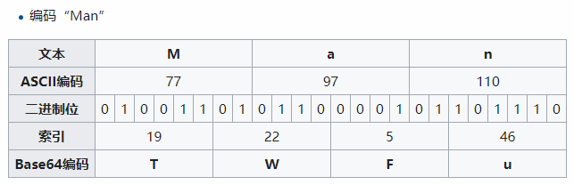
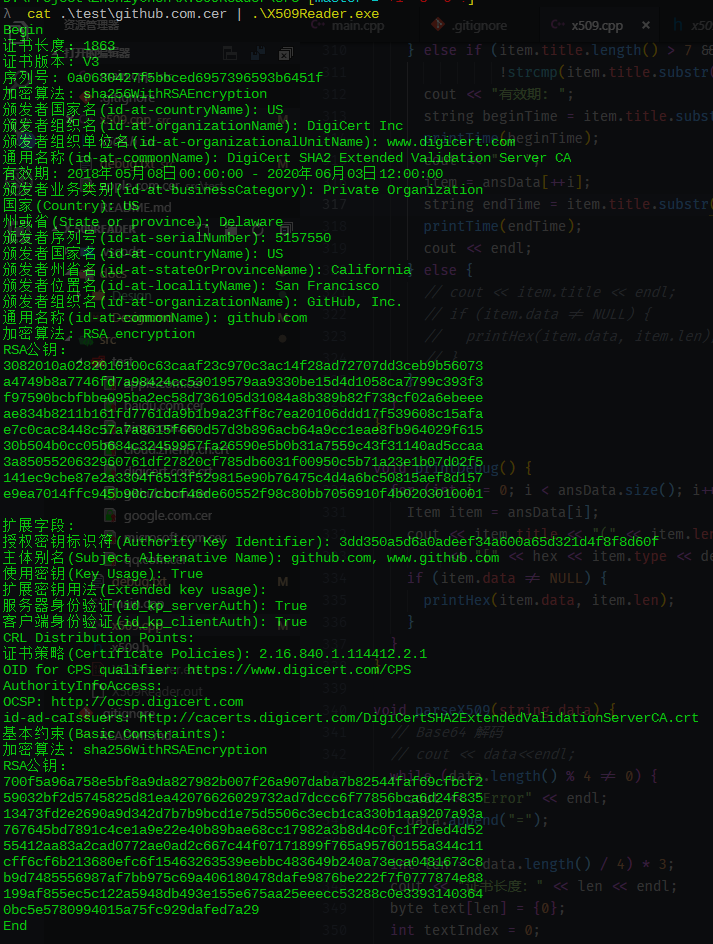
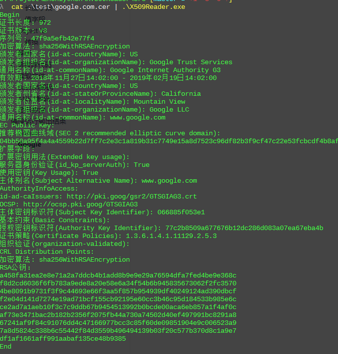
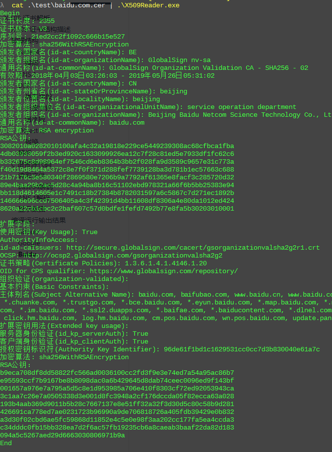
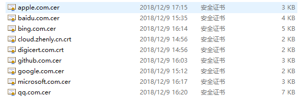

# X.509 证书解析

## X.509 证书结构描述

X.509证书有多种常用的文件扩展名，代表着不同形式的数据编码以及内容

其中常见的有（来自Wikipedia）：

- `.pem` – [DER](https://zh.wikipedia.org/w/index.php?title=DER&action=edit&redlink=1)编码的证书再进行[Base64](https://zh.wikipedia.org/wiki/Base64)编码的数据
- `.cer`, `.crt`, `.der` – 通常是[DER](https://zh.wikipedia.org/w/index.php?title=DER&action=edit&redlink=1)二进制格式的，但Base64编码后也很常见。
- `.p7b`, `.p7c` – [PKCS#7](https://zh.wikipedia.org/wiki/%E5%85%AC%E9%92%A5%E5%AF%86%E7%A0%81%E5%AD%A6%E6%A0%87%E5%87%86) SignedData structure without data, just certificate(s) or [CRL](https://zh.wikipedia.org/wiki/%E8%AF%81%E4%B9%A6%E5%90%8A%E9%94%80%E5%88%97%E8%A1%A8)(s)
- `.p12` – [PKCS#12](https://zh.wikipedia.org/wiki/%E5%85%AC%E9%92%A5%E5%AF%86%E7%A0%81%E5%AD%A6%E6%A0%87%E5%87%86)格式，包含证书的同时可能还有带密码保护的私钥
- `.pfx` – PFX，PKCS#12之前的格式（通常用PKCS#12格式，比如那些由[IIS](https://zh.wikipedia.org/wiki/IIS)产生的PFX文件）

这里我主要解析的是`DER`二进制格式经过Base64编码后的数据

其中证书的组成结构标准用`ASN.1`来进行描述，有着不同的版本，其中`V3`版本的基本结构如下（Wikipedia）：

- 证书 
  - 版本号：标识证书的版本（版本1、版本2或是版本3）
  - 序列号：标识证书的唯一整数，由证书颁发者分配的本证书的唯一标识符
  - 签名算法：用于签证书的算法标识，由对象标识符加上相关的参数组成，用于说明本证书所用的数字签名算法
  - 颁发者：证书颁发者的可识别名（DN）
  - 证书有效期 ：此日期前无效 - 此日期后无效
  - 主体：证书拥有者的可识别名
  - 主体公钥信息 
    - 公钥算法
    - 主体公钥
  - 颁发者唯一身份信息（可选项）
  - 主体唯一身份信息（可选项）
  - 扩展信息（可选项） 
    - 发行者密钥标识符：证书所含密钥的唯一标识符，用来区分同一证书拥有者的多对密钥
    - 密钥使用：指明（限定）证书的公钥可以完成的功能或服务，如：证书签名、数据加密等
    - CRL分布点
    - 私钥的使用期
    - 证书策略：由对象标识符和限定符组成，这些对象标识符说明证书的颁发和使用策略有关
    - 策略映射
    - 主体别名：指出证书拥有者的别名，如电子邮件地址、IP地址等
    - 颁发者别名：指出证书颁发者的别名
    - 主体目录属性：证书拥有者的一系列属性
  - 证书签名算法
  - 数字签名


## 数据结构

### Base64

为了在互联网上传输，大多数证书都是采用Base64编码，以可打印字符的形式表示二进制数据流。

Base64编码由RFC 1421和RFC 2045定义，一共有64个可打印字符，因此每六个比特表示为一个单元，以64种字符表示二进制数据。

#### 解码

首先取出一组（4个字符），按照其值在`ABCDEFGHIJKLMNOPQRSTUVWXYZabcdefghijklmnopqrstuvwxyz0123456789+/`中位置获得其代表的值，然后依次从高位到低位放入一个24位的缓冲区中，最后将其划分为三个八位的字符。

下面是维基百科上一个简单的例子




在C++中，只需要一个简单的循环，每次以原数据的4个单元为一组，将其转换成3个八位的数据。

```c++
byte text[len] = {0};
int textIndex = 0;
for (int i = 0; i < data.length(); i += 4) {
  byte base64_bit_6[4];
  for (int j = 0; j < 4; j++) {
    base64_bit_6[j] = base64_chars.find(data[i + j]);
  }
  text[textIndex] =
    ((base64_bit_6[0] & 0x3f) << 2) | ((base64_bit_6[1] & 0x30) >> 4);
  text[textIndex + 1] =
    ((base64_bit_6[1] & 0xf) << 4) | ((base64_bit_6[2] & 0x3c) >> 2);
  text[textIndex + 2] =
    ((base64_bit_6[2] & 0x3) << 6) | (base64_bit_6[3] & 0x3f);
  textIndex += 3;
}
```


### ANS.1

经过Base64解码后，就是证书中的内容了，按照标准，这一部分的内容使用`ANS.1`表示。

ANS.1是一套描述数据表示、编码、传输、解码的灵活的记法，是一套正式、无歧义和精确的规则。我们可以使用ANS.1描述独立于计算机硬件的对象结构。

对于X.509证书标准，存在以下的结构：

```
Certificate  ::=  SEQUENCE  {
  tbsCertificate       TBSCertificate,
  signatureAlgorithm   AlgorithmIdentifier,
  signatureValue       BIT STRING  }

TBSCertificate  ::=  SEQUENCE  {
  version         [0]  EXPLICIT Version DEFAULT v1,
  serialNumber         CertificateSerialNumber,
  signature            AlgorithmIdentifier,
  issuer               Name,
  validity             Validity,
  subject              Name,
  subjectPublicKeyInfo SubjectPublicKeyInfo,
  issuerUniqueID  [1]  IMPLICIT UniqueIdentifier OPTIONAL,
												-- If present, version MUST be v2 or v3
	subjectUniqueID [2]  IMPLICIT UniqueIdentifier OPTIONAL,
												-- If present, version MUST be v2 or v3
	extensions      [3]  EXPLICIT Extensions OPTIONAL
												-- If present, version MUST be v3}

Version  ::=  INTEGER  {  v1(0), v2(1), v3(2)  }

CertificateSerialNumber  ::=  INTEGER

Validity ::= SEQUENCE {
  notBefore      Time,
  notAfter       Time }

Time ::= CHOICE {
  utcTime        UTCTime,
  generalTime    GeneralizedTime }

UniqueIdentifier  ::=  BIT STRING

SubjectPublicKeyInfo  ::=  SEQUENCE  {
  algorithm            AlgorithmIdentifier,
  subjectPublicKey     BIT STRING  }

Extensions  ::=  SEQUENCE SIZE (1..MAX) OF Extension

Extension  ::=  SEQUENCE  {
  extnID      OBJECT IDENTIFIER,
  critical    BOOLEAN DEFAULT FALSE,
  extnValue   OCTET STRING
              -- contains the DER encoding of an ASN.1 value
              -- corresponding to the extension type identified
              -- by extnID
              }
```


### DER

证书中的ANS.1数据是以DER编码而来的。

具体的文档可以查看http://luca.ntop.org/Teaching/Appunti/asn1.html

DER为ANS.1类型定义了一种唯一的编码方案。

对于每一种数据类型，其DER编码由以下四部分组成：

- 类型字段：tag(T)
- 长度字段：length(L)
- 值字段：value(V)
- 结束表示字段


#### 类型字段

类型由一个字节（8位）大小的数据表示

其中高两位(8-7)表示了TAG的类型：

- `00`: universal
- `01`: application
- `10`: context-specific
- `11`: private

第六位表示是否位结构化类型：

- `0`: 简单类型
- `1`：结构类型

剩余的五位(5-1)就是表示具体的类型

比较常用的类型有

| Type                         | Tag number (decimal) | Tag number (hexadecimal) |
| ---------------------------- | -------------------- | ------------------------ |
| `INTEGER`                    | 2                    | `02`                     |
| `BIT STRING`                 | 3                    | `03`                     |
| `OCTET STRING`               | 4                    | `04`                     |
| `NULL`                       | 5                    | `05`                     |
| `OBJECT IDENTIFIER`          | 6                    | `06`                     |
| `SEQUENCE` and `SEQUENCE OF` | 16                   | `10`                     |
| `SET` and `SET OF`           | 17                   | `11`                     |
| `PrintableString`            | 19                   | `13`                     |
| `T61String`                  | 20                   | `14`                     |
| `IA5String`                  | 22                   | `16`                     |
| `UTCTime`                    | 23                   | `17`                     |


#### 长度字段

长度字段，有两种编码格式。

若长度值小于等于127，则用一个字节表示，bit8 = 0, bit7-bit1 存放长度值

若长度值大于127，则用多个字节表示，可以有2到127个字节。第一个字节的第8位为1，其它低7位给出后面该域使用的字节的数量，从该域第二个字节开始给出数据的长度，高位优先。

还有一种特殊情况，这个字节为`0x80`，表示数据块长度不定，由数据块结束标识结束数据块。


#### 值字段

根据不同类型，值字段可以表示不同的数据，如Ascii字符、16进制字符串、OID


### Object ID

在证书中的各种值中，比较常见的就是`Object ID`(对象标识符)

对象标识符是由国际电信联盟(ITU)和ISO/IEC标准化的标识符机制，用于表示对一个对象、概念或者事务的全球化的一种标识。

OID是由一连串以点`.`分隔的数字组成，

比如：`1.3.6.1.4.1.343`

表示的是

- 1： ISO assigned OIDs（ISO指定的OID）
- 1.3 ： ISO Identified Organization （ISO认证组织）
- 1.3.6： US Department of Defense （美国国防部）
- 1.3.6.1 ：Internet （因特网）
- 1.3.6.1.4： Internet Private （互联网专用）
- 1.3.6.1.4.1 ：IANA-registered Private Enterprises （私营企业）
- 1.3.6.1.4.1.343 ：Intel Corporation （英特尔公司）

不同的OID表示的信息可以在网上查到 https://www.alvestrand.no/objectid/1.3.6.1.4.1.343.html

在X.509证书里面，证书颁发者的地区、国家就是使用OID来表示的


#### 转换

那么我们如何将二进制数据转换成OID标识呢？

在X.509的值的二进制数据中，一个OID表示的值如下

`00101010 10000110 01001000 10000110 11110111 00001101 00000001 00000001 00001011`

将其分为8位大小的块，每一块的第一位表示是否为结束块

如果是1就和后面的连在一起

如果是0就是一个独立的块

得到以下的7bit的6个块

`0101010 00001101001000 000011011101110001101 0000001 0000001 0001011`

然后化为10进制

`42 840 113549 1 1 11`

对第一位`X`进行特殊处理，使其变为两个位

- 第一位：`min([X/40], 2)` 
- 第二位： `X - 40 * 第一位 `

 因此`42 = 40 * 1 + 2`，可以分解为1和2，然后得到以下的OID

`1.2.840.113549.1.1.11`

在网上查找数据库，得出以下数据

[1.2.840.113549.1.1.11](https://www.alvestrand.no/objectid/1.2.840.113549.1.1.11.html) - sha256WithRSAEncryption

- [1.2.840.113549.1.1](https://www.alvestrand.no/objectid/1.2.840.113549.1.1.html) - PKCS-1
- [1.2.840.113549.1](https://www.alvestrand.no/objectid/1.2.840.113549.1.html) - PKCS
- [1.2.840.113549](https://www.alvestrand.no/objectid/1.2.840.113549.html) - RSADSI
- [1.2.840](https://www.alvestrand.no/objectid/1.2.840.html) - USA
- [1.2](https://www.alvestrand.no/objectid/1.2.html) - ISO member body
- [1](https://www.alvestrand.no/objectid/1.html) - ISO assigned OIDs
- [Top of OID tree](https://www.alvestrand.no/objectid/top.html)

因此，这个标识符表示这个证书使用的加密算法为`sha256WithRSAEncryption`


在C++里面，只要了解其结构，就可以很简单将二进制数据转换成OID字符串

```c++
String title = "";
oiFirst = data[i] & 0x7f;
oiIndex = min(oiFirst / 40, 2);
title.append(to_string(min(oiFirst / 40, 2)));
title.append(".");
title.append(to_string(oiFirst - 40 * oiIndex));
title.append(".");
oiIndex = 2;
oiFirst = 0;
for (int t = 1; t < lens.len; t++) {
  oiFirst <<= 7;
  oiFirst += data[i + t] & 0x7f;
  if (!(data[i + t] & 0x80)) {
    title.append(to_string(oiFirst));
    title.append(".");
    oiIndex++;
    oiFirst = 0;
  }
}
// title 为OID字符串
```


### 解析

下面对我的网站`www.zhenly.cn`的证书数据逐一解析

```c
30 82 05 93 // SEQUENCE类型(30), 长度的长度2(82),长度1427(0593) Certificate::

30 82 04 7b // SEQUENCE类型(30),长度的长度2(82),长度1147(047b) tbsCertificate::

a0 03       // 特殊内容-证书版本(a0),长度3(03) Version::
02 01       // 整数类型(02),长度1
02          // 版本：3(02)

02 10       // 整数类型(02),长度16(10) serialNumber::
08 ea ef ef ac a5 62 e2 98 0e 0c 3b 99 e6 a5 a6 
//  序列号：08eaefefaca562e2980e0c3b99e6a5a6

30 0d       // SEQUENCE类型(30),长度13
06 09       // Object Identifier 类型(06)，长度9(09)
2a 86 48 86 f7 0d 01 01 0b // signature:: 签名算法

// 00101010 10000110 01001000 10000110 11110111 00001101 00000001 00000001 00001011
// 第一位表示是否为结束块，如果是1就和后面的连在一起，得到以下的7bit的9位东西
// 0101010 00001101001000 000011011101110001101 0000001 0000001 0001011
// 化为10进制
// 42 840 113549 1 1 11
// 对第一位特殊处理 42 = 40 * 1 + 2， 变成1 2（第一位 min([42/40], 2) 第二位 42 - 40 * 第一位 ）
// 1 2 840 113549 1 1 11
// {iso(1) member-body(2) us(840) rsadsi(113549) pkcs(1) pkcs-1(1) rsaEncryption(11)}
// https://www.alvestrand.no/objectid/1.2.840.113549.1.1.11.html
// 1.2.840.113549.1.1.11 - sha256WithRSAEncryption
05 00       // Null(05) 长度0(0) 密钥参数

30 72       // SEQUENCE类型(30), 长度114(72)

31 0b       // SET类型(31) 无序数列, 长度11(b)
30 09       // SEQUENCE类型(30) 长度9(09)
06 03       // Object Identifier 类型(06)，长度3(03)
55 04 06    // 2.5.4.6 - id-at-countryName
13 02       // Printable String类型(13) 长度2(02)
43 4e       // CN  C(43) N(4e) ASCII

31 25       // SET类型(31) 无序数列, 长度37(25)
30 23       // SEQUENCE类型(30), 长度35(23)
06 03       // Object Identifier 类型(06)，长度3(03)
55 04 0a    // 2.5.4.10 - id-at-organizationName
13 1c       // Printable String类型(13) 长度28(1c)
54 72 75 73 74 41 73 69 61 20 54 65 63 68 6e 6f 6c 6f 67 69 65 73 2c 20 49 6e 63 2e // TrustAsia Technologies, Inc.

31 1d       // SET类型(31) 无序数列, 长度29(1d)
30 1b       // SEQUENCE类型(30), 长度27(1b)
06 03       // Object Identifier 类型(06)，长度3(03)
55 04 0b    // 2.5.4.11 - id-at-organizationalUnitName
13 14       // Printable String类型(13) 长度20(14)
44 6f 6d 61 69 6e 20 56 61 6c 69 64 61 74 65 64 20 53 53 4c // Domain Validated SSL

31 1d       // SET类型(31) 无序数列, 长度29(1d)
30 1b       // SEQUENCE类型(30), 长度27(1b)
06 03       // Object Identifier 类型(06)，长度3(03)
55 04 03    // 2.5.4.3 - id-at-commonName
13 14       // Printable String类型(13) 长度20(14)
54 72 75 73 74 41 73 69 61 20 54 4c 53 20 52 53 41 20 43 41 // TrustAsia TLS RSA CA

30 1e       // SEQUENCE类型(30), 长度30(1e)
17 0d       // UTCTime类型(17), 长度13(0d)
31 38 31 30 32 37 30 30 30 30 30 30 5a // 181027000000Z

17 0d       // UTCTime类型(17), 长度13(0d)
32 30 30 31 32 35 31 32 30 30 30 30 5a // 200125120000Z

// Subject 信息
30 18       // SEQUENCE类型(30), 长度24(18)
31 16       // SET类型(31) 无序数列, 长度22(16)
30 14       // SEQUENCE类型(30), 长度20(14)
06 03       // Object Identifier 类型(06)，长度3(03)
55 04 03    // 2.5.4.3 - id-at-commonName
13 0d       // Printable String类型(13) 长度13(d)
77 77 77 2e 7a 68 65 6e 6c 79 2e 63 6e // www.zhenly.cn

30 82 01 22 // SEQUENCE类型(30), 长度的长度2(82), 长度290(0122)

30 0d       // SEQUENCE类型(30), 长度13(d)
06 09       // Object Identifier 类型(06)，长度9(09)
2a 86 48 86 f7 0d 01 01 01
// ‭00101010 10000110 01001000 10000110 ‭11110111‬ 00001101 00000001 00000001 00000001‬
// 0101010 00001101001000 000011011101110001101 0000001 0000001 0000001‬
// 42 840 113549 1 1 1
// 1.2.840.113549.1.1.1
// RSA encryption
05 00 // Null

03 82 01 0f  // BIT STRING类型， 长度的长度2(82), 长度‭271‬(010f)
00           // 开始 270位RSA公钥
30 82 01 0a 02 82 01 01 00 b3 f3 cf fd f4 6f bb fd 45 80 ae 80 01 8e dd 85 f4 87
18 47 51 fa a3 6f f3 61 41 47 c9 58 dd b6 87 e3 18 df 05 2b 14 fd 6d 31 e7 78 ef
03 c9 53 b2 5f 11 fa 49 51 2f 56 57 c1 84 5e 7a f9 7f c0 55 ec 64 26 0b 07 2e 67
99 1c c4 65 66 de cb 32 a9 a3 ed 96 e5 1e 0f 43 35 d9 14 d6 4f fd 20 ed fd 08 2e
b4 ad fb 97 44 a6 9d 5f 06 9f 24 7d dc cf 91 41 ca f8 22 49 3d ab 47 76 96 88 7d
69 3d 25 c6 b4 84 6d 6d 44 b4 b7 41 65 8c 55 16 31 c3 56 50 a9 49 b0 90 e5 47 ec
33 5e 80 5a 78 9a 75 91 6e f9 11 f8 64 6f b1 93 35 bb 7a 0d b2 20 2e ca 6b 3b 63
c5 ef 38 e8 c0 b1 07 72 7d c4 c6 b5 5b f7 9c e5 ae 3e 1b cb 7a 18 6c 3e 48 ef d9
88 64 d6 63 25 a1 56 47 00 0e a9 8b aa 6d ac d6 19 c8 aa af da 95 28 c0 54 32 90
0c 6b 94 1f 10 cd 16 87 22 a9 6f 65 70 ac 55 ad 5a a3 d5 b8 97 ab 02 03 01 00 01


a3 82 02 7d // 扩展字段(a3),长度的长度2(82),长度637(27d)

30 82 02 79 // SEQUENCE类型(30),长度的长度2(82), 长度‭633‬(279)

30 1f       // SEQUENCE类型(30),长度‭‭31‬‬(1f)
06 03       // Object Identifier 类型(06)，长度3(03)
55 1d 23
// ‭01010101 00011101 00100011‬
// ‭85‬ 29 35
// 2.5.29.35 - Authority Key Identifier

04 18       // OCTET STRING类型(04)，长度24(18)
30 16       // SEQUENCE类型(30),长度22(16)
80 14       // 表示证书的版本(80), 长度20(14)
7f d3 99 f3 a0 47 0e 31 00 56 56 22 8e b7 cc 9e dd ca 01 8a // 7fd399f3a0470e31005656228eb7cc9eddca018a

30 1d       // SEQUENCE类型(30),长度29‬‬(1d)
06 03       // Object Identifier 类型(06)，长度3(03)
55 1d 0e    // 2.5.29.14 - Subject Key Identifier

04 16       // OCTET STRING类型(04)，长度22(16)
04 14       // OCTET STRING类型(04)，长度20(14)
83 ad 62 8f f3 56 c4 1b f3 26 5e 3e 4f 5f 09 90 1e 7c fe bf // 83ad628ff356c41bf3265e3e4f5f09901e7cfebf

30 23       // SEQUENCE类型(30),长度35‬‬(23)
06 03       // Object Identifier 类型(06)，长度3(03)
55 1d 11    // 2.5.29.17 - Subject Alternative Name
04 1c       // OCTET STRING类型(04)，长度28(1c)
30 1a       // SEQUENCE类型(30),长度26‬‬(1a)
82 0d       // subjectUniqueID表示证书主体的唯一id(82),长度13(d)
77 77 77 2e 7a 68 65 6e 6c 79 2e 63 6e // www.zhenly.cn

82 09      // subjectUniqueID表示证书主体的唯一id(82),长度9(09)
7a 68 65 6e 6c 79 2e 63 6e // zhenly.cn

30 0e       // SEQUENCE类型(30),长度14‬‬(e)
06 03       // Object Identifier 类型(06)，长度3(03)
55 1d 0f    // 2.5.29.15 - Key Usage
01 01       // 布尔值类型(01)， 长度1(01)
ff          // true

04 04       // OCTET STRING类型(04)，长度4(04)
03 02 05 a0 // ???

30 1d       // SEQUENCE类型(30),长度29‬‬(1d)
06 03       // Object Identifier 类型(06)，长度3(03)
55 1d 25    // 2.5.29.37 - Extended key usage

04 16       // OCTET STRING类型(04)，长度22(16)
30 14       // SEQUENCE类型(30),长度20‬‬(14)
06 08       // Object Identifier 类型(06)，长度8(08)
2b 06 01 05 05 07 03 01
// 2b060105 05070301
// ‭00101011 00000110 00000001 00000101‬ 0000‭0101 00000111 00000011 00000001‬
// ‭0101011 0000110 0000001 0000101‬ 000‭0101 0000111 0000011 0000001‬
// 43 6 1 5 5 7 3 1
// 1.3.6.1.5.5.7.3.1 - id_kp_serverAuth

06 08       // Object Identifier 类型(06)，长度8(08)
2b 06 01 05 05 07 03 02 // 1.3.6.1.5.5.7.3.2 - id_kp_clientAuth

30 4c       // SEQUENCE类型(30),长度‭76‬(4c)
06 03       // Object Identifier 类型(06)，长度3(03)
55 1d 20    // 2.5.29.32 - Certificate Policies

04 45       // OCTET STRING类型(04)，长度69(45)
30 43       // SEQUENCE类型(30),长度‭67‬(43)
30 37       // SEQUENCE类型(30),长度‭55‬(37)
06 09       // Object Identifier 类型(06)，长度9(09)
60 86 48 01 86 fd 6c 01 02
// 60864801 86fd6c01 02
// ‭01100000 10000110 01001000 00000001‬ ‭10000110 11111101 01101100 00000001‬ 00000010
// ‭1100000 00001101001000 0000001‬ ‭000011011111011101100 0000001‬ 0000010
// 96 840 1 114412 1 2
// 2.16.840.1.114412.1.2 - Digicert EV

30 2a       // SEQUENCE类型(30),长度‭42(2a)
30 28       // SEQUENCE类型(30),长度‭40(28)
06 08       // Object Identifier 类型(06)，长度8
2b 06 01 05 05 07 02 01
// 2b060105 05070201
// 00101011 00000110 00000001 00000101 0000‭0101 00000111 00000010 00000001‬
// 0101011 0000110 0000001 0000101 000‭0101 0000111 0000010 0000001‬
// 43 6 1 5 5 7 2 1
// 1.3.6.1.5.5.7.2.1 - id-qt-cps: OID for CPS qualifier

16 1c       // IA5String类型(16),长度28
68 74 74 70 73 3a 2f 2f 77 77 77 2e 64 69 67 69 63 65 72 74 2e 63 6f 6d 2f 43 50 53 // https://www.digicert.com/CPS

30 08       // SEQUENCE类型(30),长度8
06 06       // Object Identifier 类型(06)，长度6
67 81 0c 01 02 01
// 67810c01 02 01
// 01100111 10000001 00001100 00000001 00000002 00000001
// 1100111 00000010001100 0000001 0000002 0000001
// 103 140 1 2 1
// 2.23.140.1.2.1 - domain-validated

30 81 81 // SEQUENCE类型(30),长度129
06 08
2b 06 01 05 05 07 01 01 // 1.3.6.1.5.5.7.1.1 - id-pe-authorityInfoAccess

04 75
30 73
30 25
06 08
2b 06 01 05 05 07 30 01 // 1.3.6.1.5.5.7.48.1 - OCSP

86 19 // 特殊IA5String类型(86),长度25
68 74 74 70 3a 2f 2f 6f 63 73 70 32 2e 64 69 67 69 63 65 72 74 2e 63 6f 6d // http://ocsp2.digicert.com

30 4a // 74
06 08
2b 06 01 05 05 07 30 02 // 1.3.6.1.5.5.7.48.2 - id-ad-caIssuers

86 3e // 特殊IA5String类型(86),长度62
68 74 74 70 3a 2f 2f 63 61 63
65 72 74 73 2e 64 69 67 69 74
61 6c 63 65 72 74 76 61 6c 69
64 61 74 69 6f 6e 2e 63 6f 6d
2f 54 72 75 73 74 41 73 69 61
54 4c 53 52 53 41 43 41 2e 63 72 74 // http://cacerts.digitalcertvalidation.com/TrustAsiaTLSRSACA.crt

30 09
06 03
55 1d 13 // 2.5.29.19 - Basic Constraints
04 02
30 00

30 82 01 04 // 206

06 0a
2b 06 01 04 01 d6 79 02 04 02
// 2b060104 01d67902 0402
// 00101011 00000110 00000001 00000100 00000001 11010110 01111001 00000010 00000100 00000010
// 0101011 0000110 0000001 0000100 0000001 10101101111001 0000010 0000100 0000010
// 43 6 1 4 1 11129 2 4 2
// 1.3.6.1.4.1.11129.2.4.2 - x.509 extension for certificate transparency SCTs

04 81 f5 // 245
04 81 f2 // 242
00 // 开始241个字符
f0 00 76 00 a4 b9 09 90 b4 18 58 14 87 bb 13 a2 cc 67 70 0a
3c 35 98 04 f9 1b df b8 e3 77 cd 0e c8 0d dc 10 00 00 01 66
b3 86 13 a9 00 00 04 03 00 47 30 45 02 21 00 da a3 73 26 49
ec 0e 64 42 48 9f 00 ba 6e d9 fa 1c 85 ca aa db ad a5 16 57
2a 47 27 3f 2b 2e bb 02 20 6a 4e 48 20 74 97 33 fc e9 a4 00
25 c5 ce be 78 d9 fd 68 66 58 3b e1 f8 98 18 4e f4 a6 4e 2b
a5 00 76 00 87 75 bf e7 59 7c f8 8c 43 99 5f bd f3 6e ff 56
8d 47 56 36 ff 4a b5 60 c1 b4 ea ff 5e a0 83 0f 00 00 01 66
b3 86 14 90 00 00 04 03 00 47 30 45 02 20 3f 27 e1 9e cc 65
2e 3c d6 67 cf 78 f5 0b 03 90 fa 7c 08 b5 11 29 c1 85 22 21
10 36 21 c8 40 e5 02 21 00 ad 36 ed be 18 ee b6 a6 cd c0 d4
96 74 62 2b 97 cc d9 b5 cf 27 9a 8a 52 61 84 57 22 60 c6 b9 5e

30 0d
06 09
2a 86 48 86 f7 0d 01 01 0b // 1.2.840.113549.1.1.11 - sha256WithRSAEncryption
05 00

03 82 01 01 // 257
00 // 开始256
63 bf 1a ec 14 19 fc 15 f6 3f cf 1f 13 9a 67 fa 47 60 6d 8d
5a 9d 45 04 ce 4e cd 76 86 96 fc 4f 62 1d ca a0 f0 4e 24 b3
ad c5 ee 85 d9 fe 8c 64 20 0e 50 97 d5 62 11 c5 20 e3 4c 7b
98 82 57 82 0e 95 27 2d a8 94 df 16 20 47 a9 b2 53 58 56 d3
39 11 c2 5a 57 20 c1 8c e7 31 62 6a 25 4c b1 38 39 97 2e 41
6d 58 c6 ac 02 23 45 e5 f2 4d 1f 92 16 49 c8 a9 6e fc bd 1a
e1 dd f0 25 4d e8 57 4d 93 10 7c 10 63 0a 0a be 51 68 ec f1
be da c7 65 22 a8 61 5c 2a 7d 40 dd 02 28 ee b3 1d b9 78 0d
b4 76 1c 72 ad 89 d5 44 12 4b 42 aa 07 77 14 4d 38 d5 81 4b
e5 09 cc 3d ba ca c9 aa b6 b1 60 34 5d 89 86 cf 78 a7 bf a5
b8 be 85 0b b9 14 0f a7 2d 7a 4c d0 2f ee 86 20 02 cf 9d d1
01 18 9a c0 a1 95 8a 8f d8 dc 3a 60 ad 67 72 56 a5 10 dd d9
81 e5 3e 72 ba d6 b1 cd 8b 2c 3a 21 90 10 0a 27
```


## C 语言源代码

代码仓库： [Github](https://github.com/ZhenlyChen/X.509Reader)

### 读取文件

首先读取证书文件，将其的

`-----BEGIN CERTIFICATE-----`和`-----END CERTIFICATE-----`之中的Base64编码读取到字符串中

```c++
// main.cpp
string fileName;
string base64Str = "";
fileName = string(argv[1]);
ifstream in(fileName);
if (!in.is_open()) {
  cout << "Error opening file";
  exit(1);
}
cout << fileName << endl;
char buffer[1024];
while (!in.eof()) {
  in.getline(buffer, 1024);
  if (string(buffer).find("BEGIN CERTIFICATE") != -1) {
    cout << "Begin" << endl;
  } else if (string(buffer).find("END CERTIFICATE") != -1) {
    parseX509(base64Str);
    cout << "End" << endl << endl;
    base64Str = "";
  } else {
    base64Str.append(buffer);
  }
}
```

### Base64解码

```c++
// x509.cpp

static const string base64_chars =
    "ABCDEFGHIJKLMNOPQRSTUVWXYZ"
    "abcdefghijklmnopqrstuvwxyz"
    "0123456789+/";

while (data.length() % 4 != 0) {
  cout << "Error" << endl;
  data.append("=");
}
int len = (data.length() / 4) * 3;
cout << "证书长度：" << len << endl;
byte text[len] = {0};
int textIndex = 0;
for (int i = 0; i < data.length(); i += 4) {
  byte base64_bit_6[4];
  for (int j = 0; j < 4; j++) {
    base64_bit_6[j] = base64_chars.find(data[i + j]);
  }
  text[textIndex] =
    ((base64_bit_6[0] & 0x3f) << 2) | ((base64_bit_6[1] & 0x30) >> 4);
  text[textIndex + 1] =
    ((base64_bit_6[1] & 0xf) << 4) | ((base64_bit_6[2] & 0x3c) >> 2);
  text[textIndex + 2] =
    ((base64_bit_6[2] & 0x3) << 6) | (base64_bit_6[3] & 0x3f);
  textIndex += 3;
}
```


### ANS.1解码

解析

```c++
parseANS(text, 0, len);
```

这里使用递归的方式解析将二进制数据根据ANS.1中的长度将其划分为不同的部分进行解析

```c++
typedef struct {
  int len;     // 长度
  int lenLen;  // 长度所占的长度
} lenData;     // 长度信息

typedef struct {
  string title;
  int len;
  byte* data;
  int type;
} Item;  // 解析项目

vector<Item> ansData;

// 长度、长度占用
lenData getLen(byte* data, int i) {
  lenData res;
  res.lenLen = 1;
  if (data[i] & 0x80) {
    int len_len = data[i] & 0x7f;
    int len = 0;
    i++;
    for (int j = 0; j < len_len; j++) {
      len <<= 8;
      len += data[i + j];
    }
    res.len = len;
    res.lenLen += len_len;
  } else {
    res.len = data[i] & 0x7f;
  }
  return res;
}

void parseANS(byte* data, int begin, int end) {
  int i = begin;
  lenData lens;
  byte* text;
  int oiFirst;
  int oiIndex;
  string title;
  int type;
  while (i < end) {
    int type = data[i];
    i++;
    lens = getLen(data, i);
    if (i + lens.lenLen <= end) {
      i += lens.lenLen;
    }
    if (lens.len <0 || i + lens.len > end) {
      break;
    }
    title = "";
    switch (type) {
      case 0x30:  // 结构体序列
        parseANS(data, i, i + lens.len);
        break;
      case 0x31:  // Set序列
        parseANS(data, i, i + lens.len);
        break;
      case 0xa3:  // 扩展字段
        title = "Extension";
        ansData.push_back({title, lens.len, NULL, type});
        parseANS(data, i, i + lens.len);
        break;
      case 0xa0:  // 证书版本
        title = "Version";
        ansData.push_back({title, lens.len, NULL, type});
        parseANS(data, i, i + lens.len);
        break;
      case 0x04:  // OCTET STRING
        // title = "Octet";
        // ansData.push_back({title, lens.len, NULL, type});
        parseANS(data, i, i + lens.len);
      case 0x05:
        break;
      case 0x06:  // Object Identifier
        title = "";
        oiFirst = data[i] & 0x7f;
        oiIndex = min(oiFirst / 40, 2);
        title.append(to_string(min(oiFirst / 40, 2)));
        title.append(".");
        title.append(to_string(oiFirst - 40 * oiIndex));
        title.append(".");
        oiIndex = 2;
        oiFirst = 0;
        for (int t = 1; t < lens.len; t++) {
          oiFirst <<= 7;
          oiFirst += data[i + t] & 0x7f;
          if (!(data[i + t] & 0x80)) {
            title.append(to_string(oiFirst));
            title.append(".");
            oiIndex++;
            oiFirst = 0;
          }
        }
        ansData.push_back(
            {title.substr(0, title.length() - 1), lens.len, NULL, type});
        break;
      case 0x17:  // 时间戳
        title = "UTCTime";
      case 0x13:  // 字符串
      case 0x82:  // subjectUniqueID
      case 0x16:  // IA5String类型
      case 0x0c:  // UTF8String类型
      case 0x86:  // 特殊IA5String类型
        for (int t = 0; t < lens.len; t++) {
          title += (char)data[i + t];
        }
        ansData.push_back({title, lens.len, NULL, type});
        break;
      case 0x01:  // 布尔类型
        oiFirst = 0xff;
        for (int t = 0; t < lens.len; t++) {
          oiFirst &= data[i + t];
        }
        ansData.push_back(
            {oiFirst == 0 ? "False" : "True", lens.len, NULL, type});
        break;
      case 0x02:  // 整数类型
      case 0x80:  // 直接输出
        text = new byte[lens.len];
        for (int t = 0; t < lens.len; t++) {
          text[t] = data[i + t];
        }
        ansData.push_back({title, lens.len, text, type});
        break;
      case 0x03:  // Bit String 类型
        text = new byte[lens.len - 1];
        for (int t = 0; t < lens.len - 1; t++) {
          text[t] = data[i + t + 1];
        }
        ansData.push_back({"", lens.len - 1, text, type});
        break;
      case 0x00:
        text = new byte[end - begin];
        for (int t = begin + 1; t < end; t++) {
          text[t - begin - 1] = data[t];
        }
        ansData.push_back({"0x00", end - begin - 1, text, type});
        break;
      default:
        i--;
        if (i + lens.len > end) {
          text = new byte[end - begin];
          for (int t = 0; t < end - begin; t++) {
            text[t] = data[i + t];
          }
          ansData.push_back({"", end - begin, text, type});
        } else {
          text = new byte[lens.len];
          for (int t = 0; t < lens.len; t++) {
            text[t] = data[i + t];
          }
          ansData.push_back({"", lens.len, text, type});
        }
        i = end;
    }
    i += lens.len;
  }
}
```


### 显示数据

我们把一些证书用到的OID存储到MAP中，然后显示出其数据的表示的意义

```c++
void printTime(string timeStr) {
  cout << "20" << timeStr[0] << timeStr[1] << "年";
  cout << timeStr[2] << timeStr[3] << "月";
  cout << timeStr[4] << timeStr[5] << "日";
  cout << timeStr[6] << timeStr[7] << ":";
  cout << timeStr[8] << timeStr[9] << ":";
  cout << timeStr[10] << timeStr[11];
}

void printHex(byte* data, int len) {
  cout << hex;
  for (int t = 0; t < len; t++) {
    cout << ((data[t] & 0xf0) >> 4) << (data[t] & 0xf);
  }
  cout << dec << endl;
}

void printHexLimit(byte* data, int len) {
  cout << hex;
  for (int t = 0; t < len; t++) {
    cout << ((data[t] & 0xf0) >> 4) << (data[t] & 0xf);
    if (t % 30 == 29) cout << endl;
  }
  cout << dec << endl;
}

void printRes() {
  std::map<string, string> titleToString = {
      {"1.3.6.1.5.5.7.3.1", "服务器身份验证(id_kp_serverAuth): True"},
      {"1.3.6.1.5.5.7.3.2", "客户端身份验证(id_kp_clientAuth): True"},
      {"2.5.29.37", "扩展密钥用法(Extended key usage):"},
      {"2.5.29.31", "CRL Distribution Points:"},
      {"1.2.840.10045.2.1", "EC Public Key:"},
      {"Extension", "扩展字段:"},
      {"2.23.140.1.2.2","组织验证(organization-validated):"},
      {"1.3.6.1.5.5.7.1.1", "AuthorityInfoAccess:"},
      {"2.5.29.19", "基本约束(Basic Constraints):"},
      {"1.3.6.1.5.5.7.3.2", "客户端身份验证(id_kp_clientAuth): True"}};
  std::map<string, string> titleToHex = {
      {"1.2.840.10045.3.1.7",
       "推荐椭圆曲线域(SEC 2 recommended elliptic curve domain): \n"},
      {"2.5.29.35", "授权密钥标识符(Authority Key Identifier): "},
      {"2.5.29.14", "主体密钥标识符(Subject Key Identifier): "}};
  std::map<string, string> titleToNext = {
      {"1.3.6.1.5.5.7.2.1", "OID for CPS qualifier: "},
      {"1.3.6.1.5.5.7.48.1", "OCSP: "},
      {"1.3.6.1.5.5.7.48.2", "id-ad-caIssuers: "},
      {"1.3.6.1.4.1.311.60.2.1.1", "所在地(Locality): "},
      {"1.3.6.1.4.1.311.60.2.1.3", "国家(Country): "},
      {"1.3.6.1.4.1.311.60.2.1.2", "州或省(State or province): "},
      {"2.5.4.3", "通用名称(id-at-commonName): "},
      {"2.5.4.5", "颁发者序列号(id-at-serialNumber): "},
      {"2.5.4.6", "颁发者国家名(id-at-countryName): "},
      {"2.5.4.7", "颁发者位置名(id-at-localityName): "},
      {"2.5.4.8", "颁发者州省名(id-at-stateOrProvinceName): "},
      {"2.5.4.9", "颁发者街区地址(id-at-streetAddress): "},
      {"2.5.4.10", "颁发者组织名(id-at-organizationName): "},
      {"2.5.4.11", "颁发者组织单位名(id-at-organizationalUnitName): "},
      {"2.5.4.12", "颁发者标题(id-at-title): "},
      {"2.5.4.13", "颁发者描述(id-at-description): "},
      {"2.5.4.15", "颁发者业务类别(id-at-businessCategory): "},
      {"2.5.29.32", "证书策略(Certificate Policies): "},
      {"2.5.29.15", "使用密钥(Key Usage): "}};

    std::map<string, string> algorithmObject = {
      {"1.2.840.10040.4.1", "DSA"},
      {"1.2.840.10040.4.3" , "sha1DSA"},
      {"1.2.840.113549.1.1.1" ,"RSA"},
      {"1.2.840.113549.1.1.2" , "md2RSA"},
      {"1.2.840.113549.1.1.3" , "md4RSA"},
      {"1.2.840.113549.1.1.4" , "md5RSA"},
      {"1.2.840.113549.1.1.5" , "sha1RSA"},
      {"1.3.14.3.2.29", "sha1RSA"},
      {"1.2.840.113549.1.1.13", "sha512RSA"},
      {"1.2.840.113549.1.1.11","sha256RSA"}};

  for (int i = 0; i < ansData.size(); i++) {
    Item item = ansData[i];
    if (!strcmp(item.title.c_str(), "Version")) {
      item = ansData[++i];
      if (item.type == 0x02) {
        cout << "证书版本: ";
        cout << "V" << item.data[0] + 1 << endl;
        item = ansData[++i];
        cout << "序列号: ";
        printHex(item.data, item.len);
      } else {
        i--;
      }
    } else if (titleToString.find(item.title) != titleToString.end()) {
      cout << titleToString[item.title] << endl;
    } else if (titleToHex.find(item.title) != titleToHex.end()) {
      string title = titleToHex[item.title];
      item = ansData[++i];
      if (item.data != NULL) {
        cout << title;
        printHex(item.data, item.len);
      } else {
        i--;
      }
    } else if (titleToNext.find(item.title) != titleToNext.end()) {
      cout << titleToNext[item.title];
      item = ansData[++i];
      cout << item.title << endl;
    } else if (algorithmObject.find(item.title) != algorithmObject.end()) {
      cout << "加密算法: " << algorithmObject[item.title];
      item = ansData[++i];
      if (item.type == 0x03) {
        cout << "\n公钥：" << endl;
        printHexLimit(item.data, item.len);
      } else {
        i--;
      }
    } else if (!strcmp(item.title.c_str(), "0x00")) {
      cout << "Public Key: " << endl;
      printHexLimit(item.data, item.len);
    } else if (!strcmp(item.title.c_str(), "2.5.29.17")) {
      cout << "主体别名(Subject Alternative Name): ";
      item = ansData[++i];
      cout << item.title;
      item = ansData[++i];
      while (item.type == 0x82) {
        cout << ", " << item.title;
        item = ansData[++i];
      }
      i--;
      cout << endl;
    } else if (item.title.length() > 7 &&
               !strcmp(item.title.substr(0, 7).c_str(), "UTCTime")) {
      cout << "有效期: ";
      string beginTime = item.title.substr(7, item.title.length() - 8);
      printTime(beginTime);
      cout << " - ";
      item = ansData[++i];
      string endTime = item.title.substr(7, item.title.length() - 8);
      printTime(endTime);
      cout << endl;
    }
  }
}
```


## 编译运行输出结果

 用这个的程序解析几大网站的X.509证书：

### Github



### Google



### Baidu



### Other

解析多个网站信息，程序都可以正常运行

